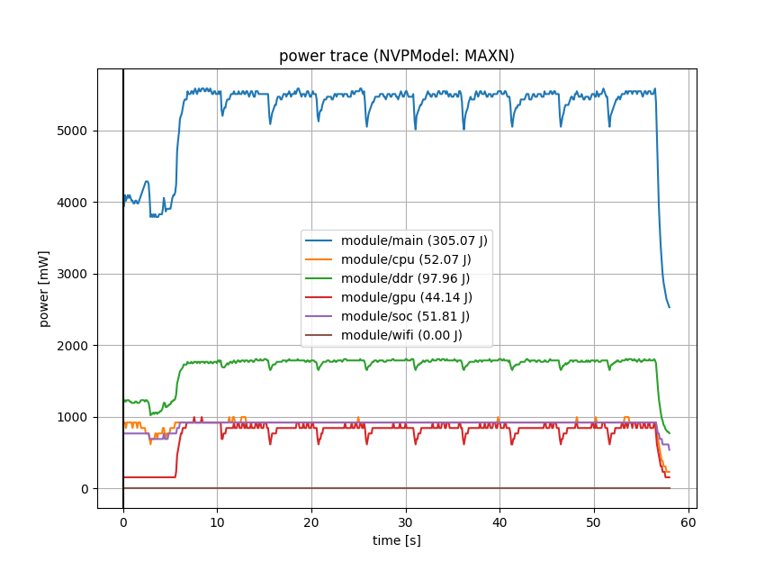
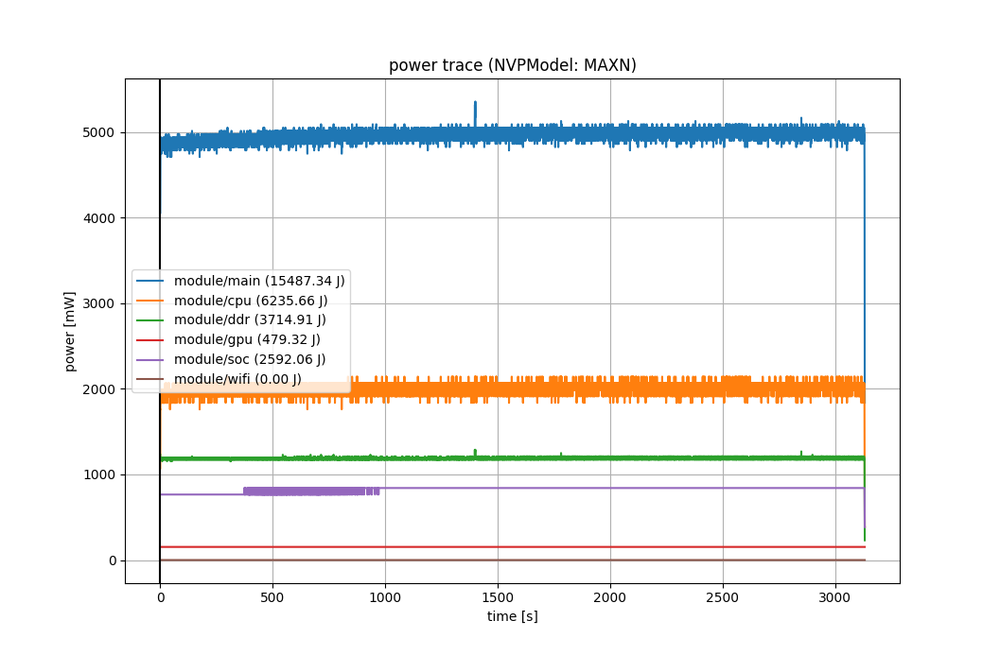

# Python Script for Measuring Power Consumption of PyTorch model on Jetson TX2 

This repository contains parts of [script to measure power consumption of Tensorflow model](https://github.com/lcm97/TX2-dnn-power-measurements) and [example script to train & test multi-layer CNN performance on MNIST dataset](https://github.com/pytorch/examples/blob/main/mnist/main.py).
This is intentionally created for an educational purpose only. 

The original repository has an explanation about different modes of Jetson TX2 and is recommended for an in-depth understanding about the hardware.

## Requirements

A list of the required packages to run the power measurement is in requirements.txt.
```
cat requirements.txt
```

## Running power measurement on GPU and ARM CPU

```
# Measuring power measurement only with GPU
python test_cnn_mnist_and_measure_power.py
# Measuring power measurement only with on-chip CPU
python test_cnn_mnist_and_measure_power.py --no-cuda
```

## Example results
Overall power consumption when running with GPU


Overall power consumption when running with only on-chip CPU

